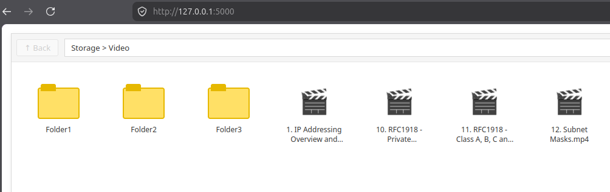

# 🎬 Simple Home Media Server in Flask



A lightweight Python (Flask) web application that scans a designated folder on your computer and displays video content.

## ✨ Features
* 💻 **User-Friendly Design** The application offers a simple and clear interface, making it easy to navigate through folders and play the video files you want to watch.
* 🎥 **Built-in Video Player:** Play video files (MP4, MKV, AVI, MOV, etc.) directly in a modern modal window on double-click without reloading the page.
* 🚀 **Clean Codebase:** Built using only Flask, Vanilla CSS, and native JavaScript — zero external CSS or JS libraries required.

---

## 📁 Project Structure

```text
├── main.py              # Application entry point (Tkinter GUI, parameters collection, thread launcher)
├── app.py               # Flask application factory and asset path configuration for PyInstaller
├── routes.py            # Server-side logic (Flask API blueprints, folder scanning, video streaming)
├── templates/
│   └── index.html       # HTML template for the Explorer interface
├── static/
│   ├── css/
│   │   └── style.css    # Interface layouts and custom CSS icons (Windows style)
│   └── js/
│       └── script.js    # Navigation logic, selection states, and API interaction
└── build/               # Automation workspace for standalone executable compilation
    └── build_linux.sh   # Automated clean build script for Linux distributions
```

---

## 🚀 Building the Standalone Executable

The application now features a graphical UI launcher (`main.py`) built with Tkinter, which safely collects runtime parameters (IP, Port, and Target Video Directory) before initializing the backend. 

To support seamless deployment as a single executable binary, the path resolution for application assets (`templates/` and `static/`) automatically adapts dynamically depending on whether the app runs as a script or as a bundled package compiled via PyInstaller.

### 🐧 Automated Clean Build on Linux

A dedicated automation build workspace is located inside the `build/` directory. The provided script executes a rigorous **Clean Build** pipeline: it spins up an isolated temporary directory, clones a fresh copy of the code directly from the repository, builds a pristine Python virtual environment (`venv`), upgrades tools, installs pinned requirements, runs PyInstaller with proper Linux path mappings, exports the final binary, and entirely wipes the temporary cache files from your operating system.

1. Open your terminal and navigate to the project root directory.
   ```bash
   curl -O https://raw.githubusercontent.com/nav-uue/cinema-hub/refs/heads/main/build/build_linux.sh
   ```
2. Grant execution permissions to the automated Linux build script:
   ```bash
   chmod +x build_linux.sh
   ```
3. Execute the build process:
   ```bash
   ./build_linux.sh
   ```

Upon successful compilation, your standalone executable binary will be generated and directly exported to your **Desktop** inside the `cinema-hub/` directory. All temporary files, PyInstaller object caches, and build-specific virtual environments are cleanly deleted, leaving your operating system completely uncluttered.

---

## 🛠️ Built With
* **Launcher & UI:** Python 3, Tkinter, TTK (Clam theme)
* **Backend:** Flask, Werkzeug, Threading
* **Frontend:** HTML5, CSS3 (Flexbox/Grid, CSS-based shapes), JavaScript (Async/Await Fetch API)
